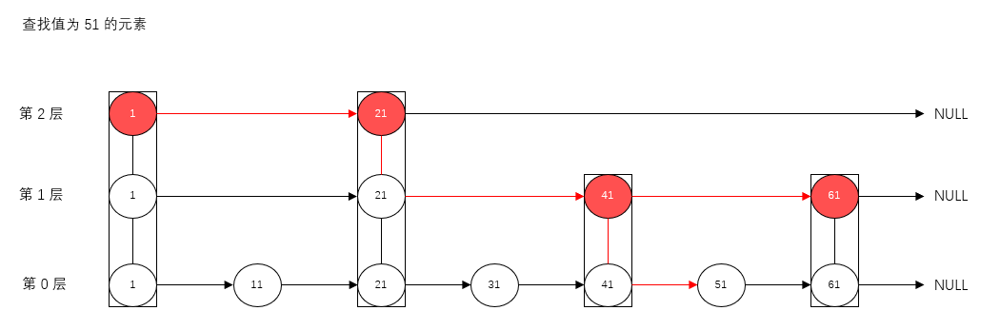

## 有序集合 zset

### 一、简介

zset 与 set 都是没有重复元素的无序字符串集合


区别于 set，zset 的每一个成员都关联了一个评分（score）

- 按照 score `由小到大`将 zset 中的成员进行排序

- zset 的成员是唯一的，但是评分可以重复


因为元素是有序的，所以可以根据 score 很快的获取一个范围的元素


访问 zset 的中间元素也是非常快的，因此能够使用 zset 作为一个没有重复成员的智能列表


### 二、常用命令

#### 2.1 zadd

`zadd <key> <score1> <value1> <score2> <value2> ...`

> 将一个或多个 member 元素及其 score 值加入到 key 对应的 zset 中

```bash
127.0.0.1:6379> zadd topn 200 java 300 c++ 400 python 500 go
(integer) 4
```


#### 2.2 zrange

`zrange <key> <start> <stop> [withscores]`

> 返回 zset 中，下标在 <start> <stop> 之间的元素
>
> 带 withscores，可以让 score 和 value 一起返回到结果集

```bash
127.0.0.1:6379> zrange topn 0 -1
1) "java"
2) "c++"
3) "python"
4) "go"
127.0.0.1:6379> zrange topn 0 -1 withscores
1) "java"
2) "200"
3) "c++"
4) "300"
5) "python"
6) "400"
7) "go"
8) "500"
```


#### 2.3 zrangebyscore

`zrangebyscore <key> <min> <max> [withscores]`

> 返回 zset 中，所有 score 值介于 min 和 max 之间（包括 min 和 max）的成员，按照 score 值递增排列

```bash
127.0.0.1:6379> zrangebyscore topn 200 400 withscores
1) "java"
2) "200"
3) "c++"
4) "300"
5) "python"
6) "400"
```


#### 2.4 zrevrangebyscore

`zrevrangebyscore<key> <max> <min> [withscores]`

> 返回 zset 中，所有 score 值介于 min 和 max 之间（包括 min 和 max）的成员，按照 score 值递减排列

```bash
127.0.0.1:6379> zrevrangebyscore topn 500 300
1) "go"
2) "python"
3) "c++"
```


#### 2.5 zincrby

`zincrby <key> <increment> <member>`

> 为 zset 的 member 元素的 score 加上 increment

```bash
127.0.0.1:6379> zincrby topn 50 java
"250"
127.0.0.1:6379> zrange topn 0 -1 withscores
1) "java"
2) "250"
3) "c++"
4) "300"
5) "python"
6) "400"
7) "go"
8) "500"
```


#### 2.6 zrem

`zrem <key> <member>`

> 删除 zset 的 member 元素

```bash
127.0.0.1:6379> zrem topn c++
(integer) 1
127.0.0.1:6379> zrange topn 0 -1
1) "java"
2) "python"
3) "go"
```


#### 2.7 zcount

`zcount <key> <min> <max>`

> 统计 zset 中，score 介于 min 和 max 之间的元素的个数

```bash
127.0.0.1:6379> zcount topn 200 300
(integer) 1
```


#### 2.6 zrank

`zrank <key> <member>`

> 返回 member 的排名，从 0 开始

```bash
127.0.0.1:6379> zrank topn go
(integer) 2
```


### 三、数据结构

zset 是 redis 提供的一个非常特别的数据结构

一方面它等价于 java 的数据结构 Map<String,Double>，可以给每个元素 member 赋予一个分数 score

另一方面它由类似于 TreeSet，内部的元素会按照分数 score 进行排序，可以得到每个元素的名次，还可以通过 score 的范围来获取元素的列表


zset 底层使用了两个数据结构

- hash，hash 的作用就是关联元素 member 和分数 score，保障元素 member 的唯一性，可以通过元素 member 找到对应的 score 值
- 跳跃表，跳跃表的目的在于给元素 member 排序，根据 score 的范围获取元素列表


> 跳跃表

跳跃表效率堪比红黑树，实现远比红黑树简单




