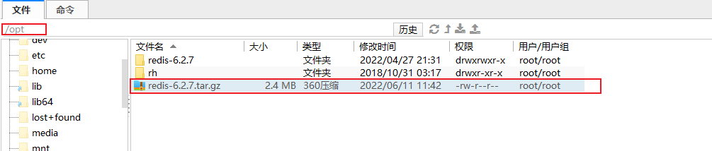
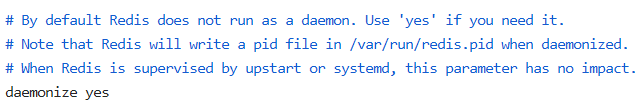

## Redis 安装

#### 一、步骤

Redis 官网：[Redis](https://redis.io/)

一般都是安装在 linux 系统中

> 安装 gcc 

```bash
# 安装命令
yum install gcc

# 检查是否安装成功
[root@localhost ~]# gcc --version
gcc (GCC) 4.8.5 20150623 (Red Hat 4.8.5-36)
Copyright © 2015 Free Software Foundation, Inc.
本程序是自由软件；请参看源代码的版权声明。本软件没有任何担保；
包括没有适销性和某一专用目的下的适用性担保。
```


> 将 redis-6.2.7.tar.gz 上传到 /opt 目录




> 解压

```bash
# 解压命令
tar -zxvf redis-6.2.7.tar.gz

# 查看是否解压成功
[root@localhost opt]# ls
redis-6.2.7  redis-6.2.7.tar.gz  rh
```


> 进入解压目录

```bash
cd redis-6.2.7
```


> 编译

```bash
# 编译命令
make

# 如果出错，删除编译文件，重新编译
make distclean
```


> 安装

```bash
make install
```


#### 二、安装目录

`/usr/local/bin`

```bash
[root@localhost ~]# cd /usr/local/bin/
[root@localhost bin]# ll
总用量 18924
-rwxr-xr-x. 1 root root 4830072 6月  11 11:55 redis-benchmark
lrwxrwxrwx. 1 root root      12 6月  11 11:55 redis-check-aof -> redis-server
lrwxrwxrwx. 1 root root      12 6月  11 11:55 redis-check-rdb -> redis-server
-rwxr-xr-x. 1 root root 5004192 6月  11 11:55 redis-cli
lrwxrwxrwx. 1 root root      12 6月  11 11:55 redis-sentinel -> redis-server
-rwxr-xr-x. 1 root root 9535976 6月  11 11:55 redis-server
```


#### 三、安装文件介绍

`redis-server：redis 服务器启动命令`

`redis-cli：redis 客户端，操作入口`

redis-benchmark：性能测试工具，检测机器性能

redis-check-aof：修复有文件的 aof 文件

redis-check-rdb：修复有文件的 rdb文件

redis-sentinel：redis 集群使用


#### 四、启动

> 前台启动（不推荐）

```bash
[root@localhost bin]# redis-server
52340:C 18 Jun 2022 14:54:10.806 # oO0OoO0OoO0Oo Redis is starting oO0OoO0OoO0Oo
52340:C 18 Jun 2022 14:54:10.806 # Redis version=6.2.7, bits=64, commit=00000000, modified=0, pid=52340, just started
52340:C 18 Jun 2022 14:54:10.806 # Warning: no config file specified, using the default config. In order to specify a config file use redis-server /path/to/redis.conf
52340:M 18 Jun 2022 14:54:10.807 * Increased maximum number of open files to 10032 (it was originally set to 1024).
52340:M 18 Jun 2022 14:54:10.807 * monotonic clock: POSIX clock_gettime
52340:M 18 Jun 2022 14:54:10.810 # A key '__redis__compare_helper' was added to Lua globals which is not on the globals allow list nor listed on the deny list.
                _._                                                  
           _.-``__ ''-._                                             
      _.-``    `.  `_.  ''-._           Redis 6.2.7 (00000000/0) 64 bit
  .-`` .-```.  ```\/    _.,_ ''-._                                  
 (    '      ,       .-`  | `,    )     Running in standalone mode
 |`-._`-...-` __...-.``-._|'` _.-'|     Port: 6379
 |    `-._   `._    /     _.-'    |     PID: 52340
  `-._    `-._  `-./  _.-'    _.-'                                   
 |`-._`-._    `-.__.-'    _.-'_.-'|                                  
 |    `-._`-._        _.-'_.-'    |           https://redis.io       
  `-._    `-._`-.__.-'_.-'    _.-'                                   
 |`-._`-._    `-.__.-'    _.-'_.-'|                                  
 |    `-._`-._        _.-'_.-'    |                                  
  `-._    `-._`-.__.-'_.-'    _.-'                                   
      `-._    `-.__.-'    _.-'                                       
          `-._        _.-'                                           
              `-.__.-'                                               

52340:M 18 Jun 2022 14:54:10.810 # WARNING: The TCP backlog setting of 511 cannot be enforced because /proc/sys/net/core/somaxconn is set to the lower value of 128.
52340:M 18 Jun 2022 14:54:10.811 # Server initialized
52340:M 18 Jun 2022 14:54:10.811 # WARNING overcommit_memory is set to 0! Background save may fail under low memory condition. To fix this issue add 'vm.overcommit_memory = 1' to /etc/sysctl.conf and then reboot or run the command 'sysctl vm.overcommit_memory=1' for this to take effect.
52340:M 18 Jun 2022 14:54:10.811 * Ready to accept connections
```


> 后台启动

1. 备份 redis.conf。将 /opt/redis.6.2.7/redis.conf 拷贝到 /etc/ 下

   ```bash
   cp /opt/redis.6.2.7/redis.conf /etc/
   ```

   

2. 将 redis.conf 里的 `daemonize no` 改成 `daemonize yes`

   

   

3. 启动 redis-server

   ```bash
   /usr/local/bin/redis-server /etc/redis.conf 
   ```


4. 查看是否启动成功

   ```bash
   [root@localhost ~]# ps -ef | grep redis
   root     104572      1  0 15:36 ?        00:00:00 /usr/local/bin/redis-server *:6379
   root     106722   7563  0 15:37 pts/0    00:00:00 grep --color=auto redis
   ```

   

5. 启动 redis-cli

   ```bash
   [root@localhost ~]# /usr/local/bin/redis-cli 
   127.0.0.1:6379> 
   ```


6. 测试

   ```bash
   127.0.0.1:6379> ping
   PONG
   ```

   

#### 五、关闭 redis-server

- 单实例关闭

  - 未进入终端进行关闭

    ```bash
    [root@localhost ~]# /usr/local/bin/redis-server /etc/redis.conf 
    [root@localhost ~]# ps -ef | grep redis
    root     125088      1  0 15:52 ?        00:00:00 /usr/local/bin/redis-server *:6379
    root     125239   7563  0 15:52 pts/0    00:00:00 grep --color=auto redis
    [root@localhost ~]# /usr/local/bin/redis-cli shutdown
    [root@localhost ~]# ps -ef | grep redis
    root     125789   7563  0 15:53 pts/0    00:00:00 grep --color=auto redis
    
    # 或直接终止进程
    [root@localhost ~]# ps -ef | grep redis
    root     127961      1  0 15:55 ?        00:00:00 /usr/local/bin/redis-server *:6379
    root     128561   7563  0 15:55 pts/0    00:00:00 grep --color=auto redis
    [root@localhost ~]# kill -9 127961
    [root@localhost ~]# ps -ef | grep redis
    root        548   7563  0 15:57 pts/0    00:00:00 grep --color=auto redis
    ```

    

  - 进入终端后进行关闭

    ```bash
    127.0.0.1:6379> shutdown
    not connected> 
    [root@localhost ~]# ps -ef | grep redis
    root     123410   7563  0 15:51 pts/0    00:00:00 grep --color=auto redis
    ```

- 多实例关闭

  ```bash
  # 指定端口关闭
  /usr/local/bin/redis-cli -p 端口号 shutdown
  ```

  

> 如果只是关闭 redis-cli，可以使用 exit 或者 ctrl +  c


