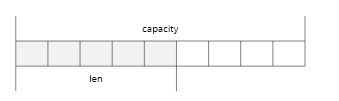

## 字符串 string

### 一、 简介

string 是 redis 最基本的类型

string 类型是`二进制安全`的，即可以包含任何数据，比如 jpg 图片或序列化的对象

string 最大是 `512M`


### 二、 常用命令

####  2.1. set

> 添加键值对 

```bash
set <key> <value>

127.0.0.1:6379> set k1 v1
OK
127.0.0.1:6379> set k2 v2
OK
127.0.0.1:6379> set k3 v3
OK
127.0.0.1:6379> keys *
1) "k2"
2) "k1"
3) "k3"

# set 命令也可以用来修改指定 key 的 value
127.0.0.1:6379> set k1 v10
OK
127.0.0.1:6379> get k1
"v10"
```


#### 2.2 setnx

> 只有 key 不存在时，可以添加对应的 key-value

```bash
setnx <key> <value>

# 返回 0 表示 k1 已经存在，设置失败
127.0.0.1:6379> setnx k1 v1
(integer) 0
```


#### 2.3 setex

> 设置键值的同时，设置过期时间，单位秒

```bash
setex <key> <过期时间> <value>

127.0.0.1:6379> setex k1 10 v1
OK
127.0.0.1:6379> ttl k1
(integer) 6
127.0.0.1:6379> ttl k1
(integer) 5
127.0.0.1:6379> ttl k1
(integer) 1
127.0.0.1:6379> ttl k1
(integer) -2
```


#### 2.4 get

> 查询对应键值

```bash
get <key>

127.0.0.1:6379> get k1
"v1"
127.0.0.1:6379> get k2
"v2"
```


#### 2.5 getset

> 以旧换新，获得旧值的同时设置新值

```bash
getset <key> <value>

127.0.0.1:6379> set k1 v1
OK
127.0.0.1:6379> getset k1 v11
"v1"
127.0.0.1:6379> get k1
"v11"
```


#### 2.6 append

> 将 value 追加到  key 的值 末尾

```bash
append <key> <value>

127.0.0.1:6379> set k1 v10
OK
# 5 表示 k1 对应的 value 当前的长度
127.0.0.1:6379> append k1 00
(integer) 5
127.0.0.1:6379> get k1
"v1000"
```


#### 2.7 strlen

> 获取 key 对应的 value 的长度

```bash
strlen <key>

127.0.0.1:6379> strlen k1
(integer) 5
```


#### 2.8 incr

> 将 key 中存储的数字加 1

```bash
# 只能对数字值操作，如果为空，新增值为 1
incr <key>

127.0.0.1:6379> set k4 500
OK
127.0.0.1:6379> incr k4
(integer) 501
```


#### 2.9 decr

> 将 key 中存储的数字减 1

```bash
# 只能对数字值操作，如果为空，新增值为 -1
decr <key>

127.0.0.1:6379> decr k4
(integer) 500
```


#### 2.10 incrby

> 将 key 中存储的数字增加自定义步长

```bash
incrby <key> <步长>

127.0.0.1:6379> set k1 200
OK
127.0.0.1:6379> incrby k1 100
(integer) 300
```


#### 2.11 decrby

> 将 key 中存储的数字减少自定义步长

```bash
decrby <key> <步长>

127.0.0.1:6379> decrby k1 100
(integer) 200
```


#### 2.12 mset

> 同时设置一个或多个 key-value 对

```bash
mset <key1> <value1> <key2> <value2> ...

127.0.0.1:6379> mset k1 v1 k2 v2 k3 v3
OK
```


#### 2.13 msetnx

> 同时设置一个或多个 key-value 对，当且仅当所有给定 key 都不存在

```bash
msetnx <key1> <value1> <key2> <value2> ...

# k1 存在，则该语句执行失败
127.0.0.1:6379> msetnx k4 v4 k5 v5 k1 v11
(integer) 0
127.0.0.1:6379> keys *
1) "k2"
2) "k1"
3) "k3"
```


#### 2.14 mget

> 同时获取一个或多个 value

```bash
mget <key1> <key2> <key3> ...

127.0.0.1:6379> mget k1 k2 k3
1) "v1"
2) "v2"
3) "v3"
```


####  2.15 setrange

> 从指定位置开始覆写 key 对应的值

```bash
setrange <key> <起始位置> <value>

127.0.0.1:6379> setrange name 2 hhh
(integer) 7
127.0.0.1:6379> get name
"abhhhfg"
```


#### 2.16 getrange

> 获取 value 的一部分，类似于 java 中的 substring 方法

```bash
getrange <key> <起始位置> <结束位置>

127.0.0.1:6379> set name abcdefg
OK
127.0.0.1:6379> getrange name 2 4
"cde"
```


### 三、 数据结构

string 的数据结构为`简单动态字符串`（Simple Dynamic String，简称 SDS）

SDS 是可以修改的字符串，内部结构实现上类似于 java 的 ArrayList，采用预分配冗余空间的方式来减少内存的频繁分配



内部为当前字符串实际分配的空间 capacity 一般要高于实际字符串长度 len 

当字符串长度小于 1M 时，扩容都是加倍现有的空间

当字符串长度超过 1M 时，扩容时一次只会扩容 1M 的空间

字符串最大长度是 512M


